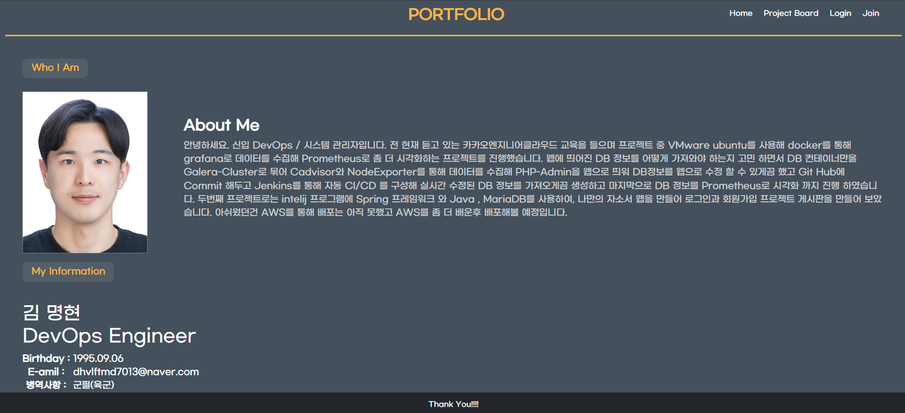

# Spring boot 를 통한 프로젝트 게시판 소개
## 기능 구현
1. 자기소개서 작성
2. 프로젝트 (마크업 언어 설정)게시판 작성
2. 수정
3. 삭제
4. 로그인 구현
5. 회원가입 구현

## 검색 기능
# 1. 질문 제목검색
```sql
    SELECT Q.*
    FROM question AS Q
    WHERE Q.subject LIKE '%sbb%';
```


# 2. 질문 제목 + 내용 검색
```sql
    SELECT Q.*
    FROM question AS Q
    WHERE Q.subject LIKE '%sbb%' OR Q.content LIKE '%sbb%';
```


# 3. 질문 제목 + 내용 검색 + 작성자
```sql
SELECT Q.*
FROM question AS Q
LEFT JOIN site_user AS SU
ON Q.author_id = SU.id
WHERE (
Q.subject LIKE '%user1%'
OR
Q.content LIKE '%user1%'
OR
SU.username LIKE '%user1%'
);

```
# 4. 질문 제목 + 내용 검색 + 작성자 + 답변 내용
```sql
SELECT Q.*
FROM question AS Q
INNER JOIN site_user AS SU
ON Q.author_id = SU.id
LEFT JOIN answer AS A
ON Q.id = A.question_id
WHERE (
Q.subject LIKE '%sbb는 질문답변 게시판입니다.%'
OR
Q.content LIKE '%sbb는 질문답변 게시판입니다.%'
OR
SU.username LIKE '%sbb는 질문답변 게시판입니다.%'
OR
A.content LIKE '%sbb는 질문답변 게시판입니다.%'
)
GROUP BY Q.id;
```

## kw 파라미터가 질문제목 검색어로 작동


## 남은 목표
- [ ] 검색기능 구현
- [ ] AWS를 통한 배포

```java

```
